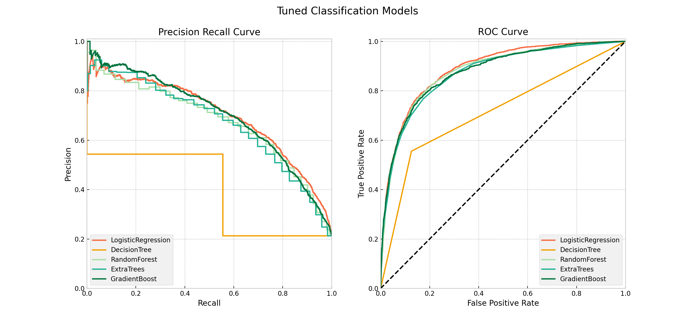

# Vaccination Status Classification

## Overview

An analysis and classification modeling of over 25,000 survey responses is completed to guide public health efforts on vaccination outreach. The highest accuracy and precision of 86% and 75% respectively is attained by the Extra Trees model predicting H1N1 vaccination status. According to the permutation importances of the model, the top features that affect H1N1 vaccination status are seasonal flu vaccination status, direct recommendation from a doctor, and health insurance.

## Business Problem

Public health agencies may be able to improve their vaccination outreach by understanding people's opinions and behaviors that may be related with whether they receive the vaccine or not. Doing so will guide public health efforts such as education campaigns to focus on the characteristics that are likely to result to vaccination as supported by relevant data. Using national survey responses, I describe vaccination patterns and classify H1N1 vaccination status based on the features in the dataset.

## Data Understanding

The H1N1 Flu Survey from late 2009 and early 2010 collected over 25,000 responses and covered questions about the individual's social, economic, and demographic background, opinions about the virus and the vaccine, and behaviors like protective measures observed. The dependent variable to predict is the individual's vaccination status: `h1n1_vaccine` . The features are described in the [data source](https://www.drivendata.org/competitions/66/flu-shot-learning/page/211/#features_list).

**Imbalanced Dataset**

| class | value_counts |
|---|---|
| 0 | 0.787546 |
| 1 | 0.212454 |

The ratio of class `0` for not vaccinated to class `1` for vaccinated is 80:20 or more concisely 4:1.

The features with the strongest correlation with H1N1 vaccination status are `doctor_recc_h1n1`, `seasonal_vaccine`, `opinion_h1n1_risk`, and `opinion_h1n1_vacc_effective`.

## Classification Modeling

The classification models used are Logistic Regression, Decision Tree, Random Forests, Extra Trees, and Gradient Boost classifier. The class imbalance is addressed using random oversampling which randomly duplicates examples of the minority class `1` in the training set. To optimize the models, a grid search ([notebook](https://github.com/czarinagluna/vaccination-status-classification/blob/main/GridSearch.ipynb)) is performed to tune their hyperparameters. 

**Classification Metrics**

Accuracy only reflects the underlying class distribution in an imbalanced dataset. If a model predicts not vaccinated all the time, it is already 80% accurate. So other classification metrics are used to measure the success of predictions. 

- Precision measures how many are actually vaccinated out of all the people predicted to be vaccinated
- Recall measures how many are correctly predicted to be vaccinated out of all the total vaccinated people

Precision-recall curve is plotted below to show the tradeoff between the two. The AUC score is the area under the ROC curve that is plotted, too. It measures the performance of models across all classification thresholds.

More specifically, precision is important to the business problem because a false positive is worse than a false negative, in this case. To predict that an individual receives the vaccine but actually does not is a bigger loss than to predict that an individual does not receive the vaccine but actually does—because the actually vaccinated individual *is vaccinated* but the indivual who is not vaccinated is **missed**. 

## Results and Recommendations

The **Tuned Extra Trees** has the highest cross validation score for accuracy at 96% and the highest precision score of 75% out of all the models. 

The tuned Extra Trees classifier's accuracy score on the `test_set` is 86%.

Comparing the confusion matrices of the baseline model and the final model, the false positive is reduced by half from 0.086 to 0.044 under the Extra Trees model.

**Permutation Importances**

> "Permutation importance does not reflect to the intrinsic predictive value of a feature by itself but **how important this feature is for a particular model**." ([Scikit-Learn Documentation](https://scikit-learn.org/stable/modules/permutation_importance.html))

The top features that affect H1N1 vaccination status on the final model are `seasonal_vaccine`, `doctor_recc_h1n1`, and `health_insurance`. 

**Recommendations**

- Direct efforts to individuals who receive the seasonal flu vaccine by providing information about and reminders to receive the H1N1 vaccine, too.
- Coordinate with primary health care providers to educate and recommend the vaccine to patients.
- Focus vaccination campaigns on a message that the vaccines are free and available for the uninsured.

**Model Deployment**

Finally, I deploy the Extra Trees classifier model as an online survey to demonstrate the prediction of vaccination status after answering the questions.

***
SOURCE CODE: [Main Notebook](https://github.com/czarinagluna/vaccination-status-classification/blob/main/main.ipynb)

# Contact

Feel free to contact me for any questions and connect with me on [Linkedin](https://www.linkedin.com/in/czarinagluna/).